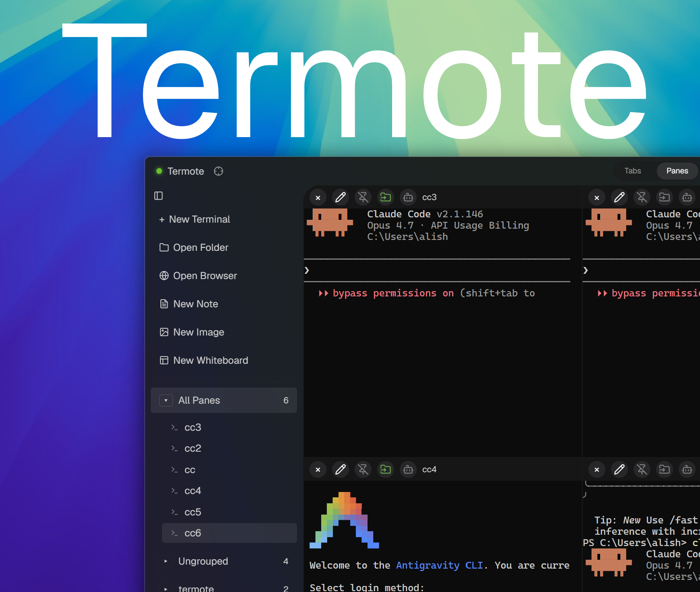
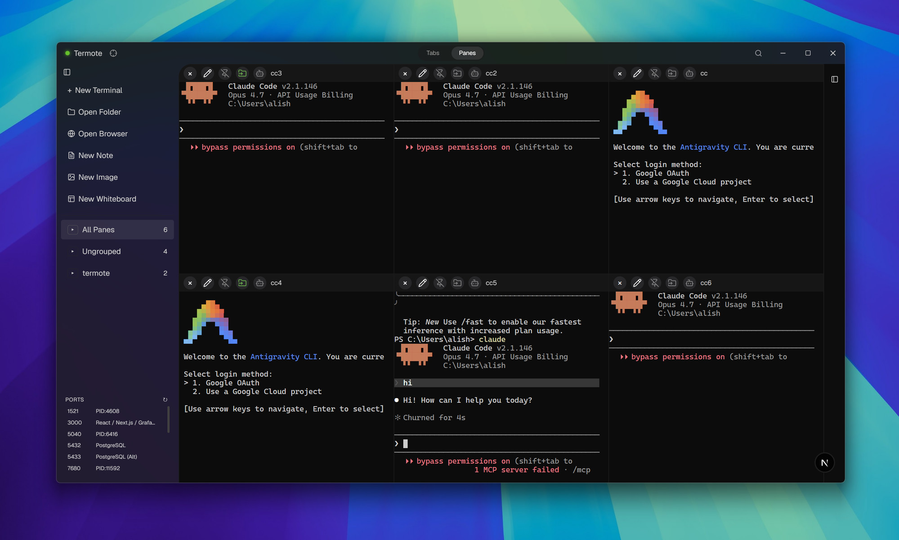
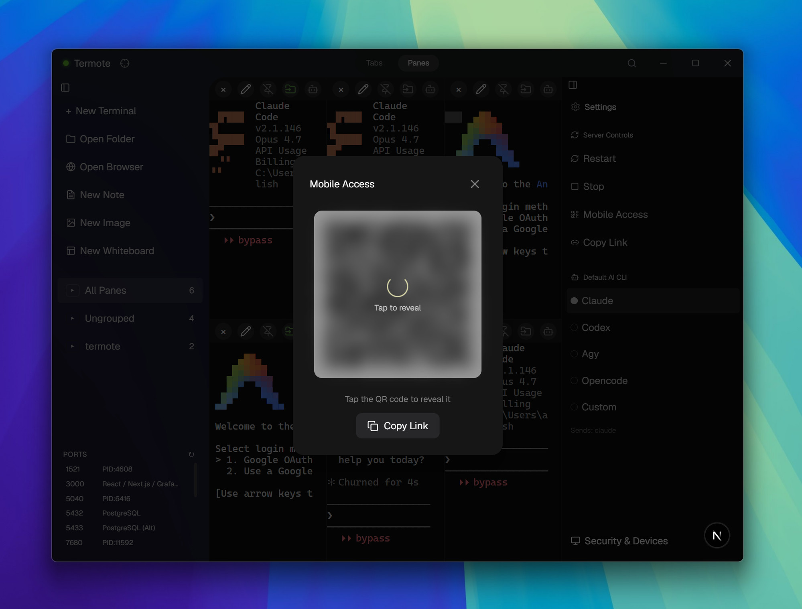
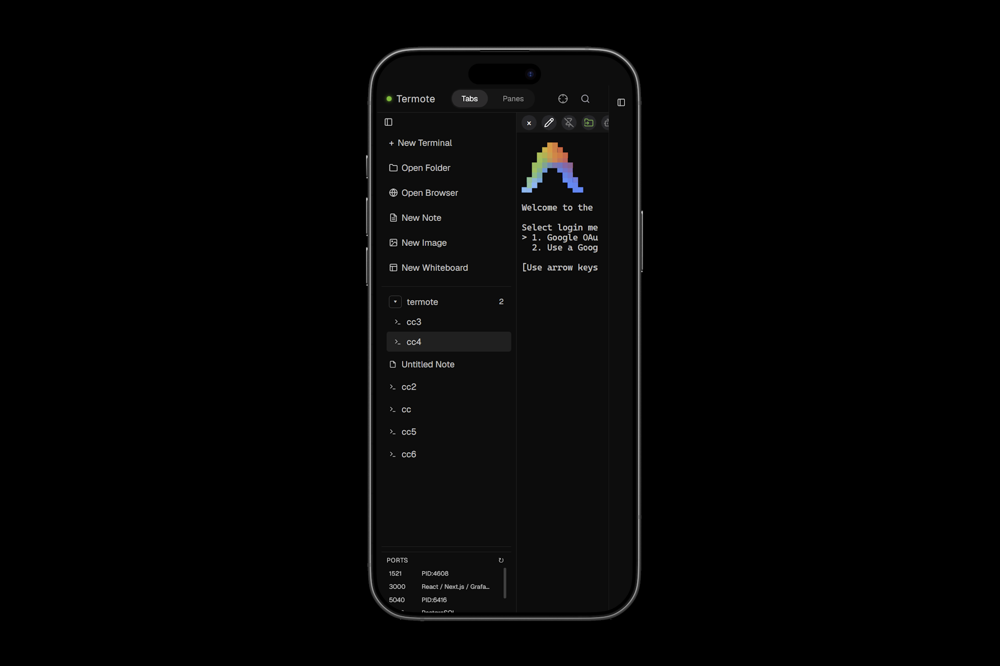
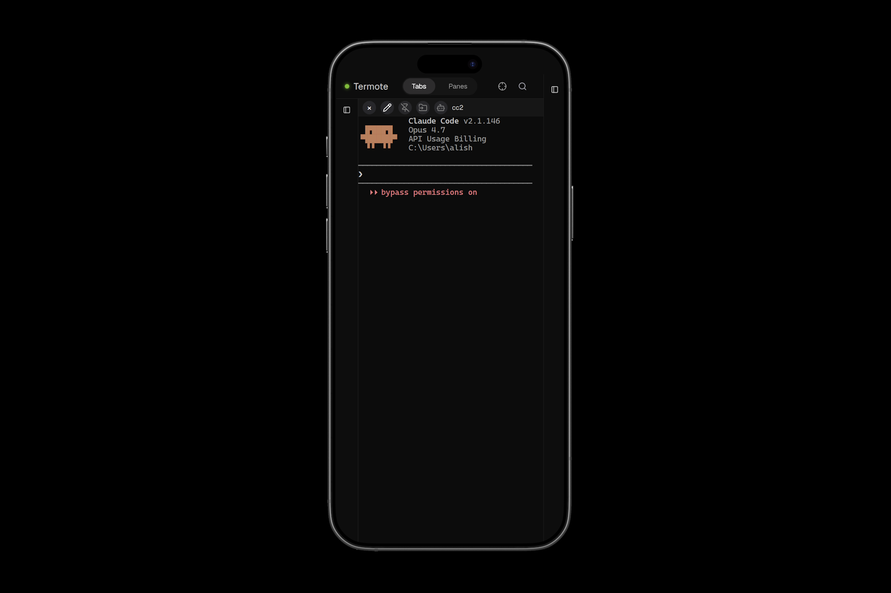

# Termote - Interfaz de Escritorio y Web

<div align="center">


[](https://github.com/AliSharjeell/Termote/actions/workflows/release.yml)

**Termote es un Entorno de Desarrollo Agéntico (ADE) ligero basado en Rust que potencia tu productividad con un espacio de trabajo persistente de múltiples paneles, herramientas integradas y acceso remoto con un solo clic, para que puedas seguir trabajando desde tu teléfono, en cualquier lugar.**

</div>

---

## Instalación Rápida

**Descárgalo desde [Lanzamientos de Termote](https://github.com/AliSharjeell/Termote/releases)**

El instalador incluye todo: una descarga, una instalación, listo.

Después de instalar, abre Termote desde el menú Inicio o escribe `termote` en cualquier terminal.

| Plataforma | Instalador |
|----------|-----------|
| Windows x64 | Instalador NSIS `.exe` |
| macOS Apple Silicon | `.dmg` |
| macOS Intel | `.dmg` |
| Linux x64 | `.AppImage`, `.deb`, `.rpm` |

---

## ¿Qué Puedes Hacer?

**Desde tu teléfono o tableta:**
- Monitorea compilaciones o scripts de larga duración
- Reinicia servidores si algo falla
- Accede a agentes de IA que se ejecutan en tu escritorio

**En tu escritorio:**
- Múltiples paneles de terminal en una sola ventana
- Vista dividida, pestañas, o ambas
- Arrastra y suelta archivos

**En cualquier lugar:**
- Conéctate mediante código QR desde dispositivos móviles

---



---

## Acceso Móvil

Escanea el código QR para conectar desde tu teléfono o tableta: no se necesita VPN.



---

## Características

| Característica | Qué hace |
|---------|--------------|
| Terminales multipanel | Divide tu espacio de trabajo en múltiples terminales |
| Acceso móvil | Ábrelo desde cualquier navegador, en cualquier lugar |
| Conexión QR | Escanea para vincular dispositivos móviles |
| Transferencia de archivos | Arrastra archivos a los paneles de terminal |
| Agentes de IA | Lanzamiento rápido de Claude Code y otras herramientas CLI |
| Reconexión automática | Maneja caídas de red de manera eficiente |

---





---

## Arquitectura

Dos componentes trabajan juntos:

| Componente | Dónde se ejecuta | Construido con |
|-----------|---------------|------------|
| **Frontend** (este repositorio) | Tu escritorio | Tauri + Next.js |
| **Backend** ([TermoteBackend](https://github.com/AliSharjeell/TermoteBackend)) | Proceso secundario (sidecar) | Rust |

El instalador empaqueta ambos juntos. Solo instalas una aplicación.

---

## Compilar desde el Código Fuente

```powershell
# Clonar ambos repositorios
git clone https://github.com/AliSharjeell/Termote.git
git clone https://github.com/AliSharjeell/TermoteBackend.git

# Compilar
cd Termote
npm install
npm run tauri:build
```

El instalador se encuentra en `src-tauri/target/release/bundle`.

---

## Automatización de Lanzamientos

Este repositorio incluye `.github/workflows/release.yml` para lanzamientos públicos. Compila instaladores nativos en ejecutores de GitHub con Windows, macOS y Ubuntu, hace checkout del repositorio del backend, empaqueta el backend y los procesos secundarios (sidecars) de Dev Tunnels, y luego carga los instaladores en un lanzamiento de GitHub.

Flujo de trabajo de GitHub Actions: [Compilar Instaladores y Lanzar](https://github.com/AliSharjeell/Termote/actions/workflows/release.yml)

Ejecútalo desde la pestaña **Actions** con la etiqueta predeterminada `termote-v0.1.0`, o publica `termote-v0.1.0`. Si `TermoteBackend` aún es privado, agrega un secreto de repositorio `TERMOTE_BACKEND_TOKEN` con permisos de lectura antes de ejecutar el flujo de trabajo.

---

## Cómo Contribuir

1. Abre un Issue o envía un correo a `alisharjeelofficial@gmail.com`
2. Obtén la asignación antes de escribir código
3. Abre un PR con pruebas

---

## Licencia

Licencia MIT

---

## Aviso Legal ⚠️

**Este es un software pre-alfa.** El desarrollo está en curso y las características pueden cambiar.

**Limitaciones conocidas:**
- **Compilaciones para macOS y Linux** — No están completamente probadas. ¡Contribuciones bienvenidas!
- **Paneles de navegador** — Experimentales, no completamente funcionales.
- **Paneles de pizarra** — Experimentales, requieren refinamiento.

Si deseas contribuir a las pruebas o al desarrollo, por favor abre un issue o contáctanos en `alisharjeelofficial@gmail.com`.
